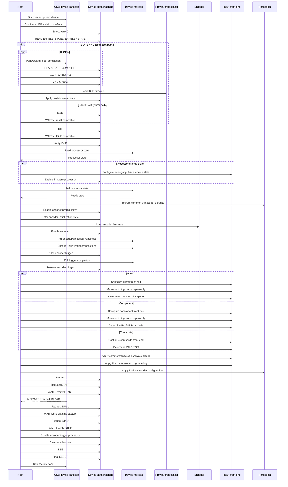

# Experimental native V4L2/DKMS driver

This directory contains the experimental native Linux kernel driver for the Elgato Game Capture HD.

The most important thing to understand when working on this driver is that the device protocol was reverse-engineered in the original libusb userspace implementation. The kernel driver is a port of that protocol, not the authoritative description of what the hardware is supposed to do.

The README describes the hardware initialization and capture setup as a generalized protocol sequence expressed in DKMS terminology. The original userspace project remains the protocol/ordering reference, but implementation and debugging should start in the DKMS files.

> **Status:** experimental / pre-hardware-validation. The kernel-side plumbing is in place, but some device-specific signal detection and mode/calibration behavior is still being brought over from the original implementation.

## Where to look

The entries below deliberately point to the **kernel driver**, not the original userspace source. Use the original project only when you need to verify protocol ordering or the meaning of a low-level operation.

| Question | Start here |
| --- | --- |
| Where does kernel-side device initialization begin? | `drivers/elgato_gchd/usb.c` → `gchd_hw_init()` |
| Where is the initial enable/state information saved? | `drivers/elgato_gchd/usb.c` → `gchd_hw_init()` → `d->hw_enable_state`, `d->hw_enable_register` |
| Where is the boot completion handshake handled? | `drivers/elgato_gchd/usb.c` → `gchd_interrupt_pend()`, `STATE_COMPLETE_INDEX` handling |
| Where is idle firmware loaded? | `drivers/elgato_gchd/usb.c` → `gchd_load_firmware()`, `FW_IDLE_OLD`, `FW_IDLE_NEW` |
| Where are reset/idle state transitions performed? | `drivers/elgato_gchd/usb.c` → `gchd_state_cmd()`, `gchd_scmd()` |
| Where is processor state checked/enabled? | `drivers/elgato_gchd/usb.c` → `gchd_processor_state()`, `gchd_enable_analog()`, `gchd_do_enable()` |
| Where are common transcoder defaults initialized? | `drivers/elgato_gchd/transcoder.c` → `gchd_transcoder_init()` |
| Where is the encoder processor started? | `drivers/elgato_gchd/input.c` → `gchd_encoder_start()` |
| Where is encoder firmware loaded? | `drivers/elgato_gchd/input.c` → `gchd_load_encoder_firmware()` |
| Where is mailbox communication implemented? | `drivers/elgato_gchd/usb.c` → `gchd_mail_write()`, `gchd_mail_read()` |
| Where is input-specific configuration performed? | `drivers/elgato_gchd/input.c` → `gchd_input_configure()` |
| Where are input-specific mailbox/register sequences issued? | `drivers/elgato_gchd/input.c` → `gchd_seq()` and the `d->input` branches |
| Where are common sub-blocks configured? | `drivers/elgato_gchd/input.c` → `gchd_setup_subblock()` |
| Where are color/mode registers programmed? | `drivers/elgato_gchd/input.c` → `gchd_color_yuv()`, `gchd_mode_regs()` |
| Where is post-encoder setup/calibration performed? | `drivers/elgato_gchd/input.c` → `gchd_post_encoder_setup()`, `gchd_post_encoder_calibration()`, `gchd_post_encoder_sweep()` |
| Where is the final input configuration state established? | `drivers/elgato_gchd/input.c` → `gchd_input_finalize()` |
| Where does V4L2 stream-on enter hardware setup? | `drivers/elgato_gchd/core.c` → `gchd_start()` |
| Where is the final capture/start state requested? | `drivers/elgato_gchd/core.c` / `usb.c` → `gchd_start()` → `gchd_state_cmd()` |
| Where does USB capture begin? | `drivers/elgato_gchd/core.c` → `gchd_rx()` |
| Where is MPEG-TS/PES processing performed? | `drivers/elgato_gchd/core.c` → `gchd_ts()`, `gchd_ring_push()`, `gchd_deliver()` |
| Where is hardware shutdown implemented? | `drivers/elgato_gchd/usb.c` → `gchd_hw_shutdown()` |

## Original protocol sequence

The original userspace implementation is the **protocol reference**. This section describes the observable hardware sequence without C++ function names so that it can be compared directly with the DKMS implementation.

The important unit of comparison is not a function call. Compare:

- operation order;
- device state before and after each operation;
- register-bank selection;
- mailbox request/response pairs;
- completion waits and acknowledgements;
- enable-bit changes;
- input-specific branches;
- repeated operations that look redundant but are present in the observed protocol;
- the final state reached.

> **Notation:** `READ` and `WRITE` are device-register operations; `MAIL` is a mailbox transaction; `WAIT` is a synchronization/polling point; `STATE` is a device state-machine transition.

### 1. Protocol overview



### 2. Phase-by-phase protocol

| Phase | Device operation | Synchronization / branch | Result |
| --- | --- | --- | --- |
| 1 | Discover USB device | Identify hardware family | Select protocol/firmware family |
| 2 | Configure USB | Configuration 1, interface 0 | Control + bulk transport available |
| 3 | Select bank 0; read `ENABLE_STATE`, `ENABLE`, `STATE` | Mask state bits | Determine cold vs. warm path |
| 4 | Cold path: optional HDNew completion handshake | Wait for completion bit `0x0004`, then acknowledge it | Device is ready for IDLE firmware |
| 5 | Cold path: load IDLE firmware | Firmware transfer must complete before continuing | Idle firmware resident |
| 6 | Warm path: RESET | Wait for reset/state completion | Existing firmware/state reset |
| 7 | IDLE transition | Wait for completion; verify resulting state | Stable idle base state |
| 8 | Read processor state | Branch on observed startup state | Decide whether processor enable is required |
| 9 | Enable firmware processor | Enable-bit transition + mailbox state | Processor brought up |
| 10 | Poll processor state | Repeat until required ready state or timeout | Processor ready |
| 11 | Program common transcoder defaults | Ordered register programming | Baseline transcoder state |
| 12 | Encoder prerequisites | Enable bits + encoder-init state | Encoder initialization begins |
| 13 | Load encoder firmware | Family-specific image | Encoder firmware resident |
| 14 | Encoder readiness | Repeated mailbox request/read + bounded retries | Encoder ready |
| 15 | Encoder trigger | Assert trigger, wait for expected mailbox completion, release trigger | Encoder initialization complete |
| 16 | Input branch | HDMI / Component / Composite | Source-specific front-end configured |
| 17 | Signal/mode detection | Repeated measurements where required | Effective input mode |
| 18 | Common hardware blocks | Ordered mailbox/register blocks | Shared processing path configured |
| 19 | Final mode programming | Resolution, scan mode, timing, color, etc. | Effective capture format programmed |
| 20 | Final transcoder programming | Mode/output-dependent register updates | Encoded output configured |
| 21 | START transition | Wait for completion; verify resulting state | Hardware is streaming |
| 22 | USB capture | Bulk IN endpoint `0x81` | MPEG transport stream available |
| 23 | Stream stop | NULL/drain, then STOP | Capture state stopped |
| 24 | Shutdown | Disable encoder/trigger/processor, clear enable state, IDLE, RESET | Hardware returned to reset state |

### 3. USB and device-family selection

The original project recognizes two supported hardware families:

| Family | Device | IDLE firmware | Encoder firmware |
| --- | --- | --- | --- |
| Original Game Capture HD | older supported PIDs | `mb86h57_h58_idle.bin` | `mb86h57_h58_enc_h.bin` |
| HDNew | PID `0x005d` | `mb86m01_assp_nsec_idle.bin` | `mb86m01_assp_nsec_enc_h.bin` |

The original project explicitly treats the HD60 and HD60 S devices as unsupported.

USB establishment is:

```text
discover device
    │
    ├─ identify supported family
    │
    ├─ detach an existing interface driver if required
    │
    ├─ select USB configuration 1
    │
    └─ claim interface 0
           │
           ▼
       protocol access
```

### 4. Initial state and cold/warm split

The first device-state operation is:

```text
SELECT BANK 0
    │
    ├─ READ ENABLE_STATE
    ├─ READ ENABLE
    └─ READ STATE
             │
             ▼
       mask state bits
             │
       ┌─────┴─────┐
       │           │
   STATE == 0   STATE != 0
       │           │
       ▼           ▼
    COLD PATH    WARM PATH
```

#### Cold path

For HDNew, the cold path has an additional synchronization point:

```text
STATE == 0
    │
    ├─ pend/wait for device completion
    │
    ├─ poll STATE_COMPLETE
    │      └─ wait for bit 0x0004
    │
    ├─ acknowledge/clear 0x0004
    │
    └─ load IDLE firmware
```

The older family proceeds to IDLE firmware loading without that HDNew-specific completion sequence.

#### Warm path

```text
STATE != 0
    │
    ├─ RESET
    ├─ WAIT for reset completion
    └─ continue with common IDLE entry
```

The cold and warm paths converge only after their respective preparation has completed.

### 5. IDLE state and processor bring-up

Both paths converge here:

```text
firmware/reset preparation complete
            │
            ▼
       request IDLE
            │
            ▼
       WAIT completion
            │
            ▼
       verify IDLE
            │
            ▼
     read processor state
```

Processor bring-up is a mailbox/state handshake, not simply a single enable write:

```text
READ processor state
        │
        ├─ startup state observed
        │       │
        │       ├─ configure analog/input-side enable state
        │       └─ enable firmware processor
        │
        ▼
POLL processor state
        │
        ├─ not ready → repeat
        │
        └─ ready → continue
```

The original sequence observes processor-state values including `0x334455` during startup and `0x27F97B` as the later ready condition.

### 6. Encoder initialization

The encoder stage is ordered:

```text
processor ready
      │
      ▼
enable encoder prerequisites
      │
      ▼
enter encoder initialization state
      │
      ▼
load encoder firmware
      │
      ▼
enable encoder
      │
      ▼
poll encoder/processor mailbox state
      │
      ├─ not ready → repeat (bounded)
      │
      └─ ready
           │
           ▼
      encoder mailbox setup
           │
           ▼
      assert encoder trigger
           │
           ▼
      poll trigger completion
           │
           ▼
      deassert encoder trigger
```

The trigger is a transient operation. It must not be documented as equivalent to the persistent encoder-enable bit.

The encoder firmware is family-specific:

- Original Game Capture HD: `mb86h57_h58_enc_h.bin`
- HDNew: `mb86m01_assp_nsec_enc_h.bin`

The original sequence also uses fixed mailbox transactions with expected/masked reply bytes. Those reads are synchronization/verification points even when their returned value is not otherwise consumed.

### 7. Input-specific configuration

After processor and encoder initialization, the protocol branches by physical input:

```text
                         input
                           │
             ┌─────────────┼─────────────┐
             ▼             ▼             ▼
           HDMI        Component      Composite
             │             │             │
             └─────────────┼─────────────┘
                           ▼
                common hardware blocks
```

The three branches are protocol-distinct.

#### HDMI

```text
HDMI front-end setup
      │
      ▼
select/read timing registers
      │
      ▼
repeat measurement samples
      │
      ▼
derive timing / resolution
      │
      ▼
determine color-space indication
      │
      ▼
merge detected values with requested settings
```

Supported original HDMI modes include 480p60, 576p60, 720p60, 1080i60, and 1080p60.

If an explicit color-space setting is supplied, it takes precedence. Otherwise the detected indication selects the corresponding RGB/YUV path.

#### Component

```text
Component front-end setup
        │
        ▼
select/read timing register pairs
        │
        ▼
10 samples per measurement pass
        │
        ▼
wait approximately 200 ms
        │
        ▼
repeat until stable / retry limit
        │
        ▼
derive PAL/NTSC + resolution + scan mode
```

Supported original Component modes include 480i60, 480p60, 576i50, 576p50, 720p60, 1080i60, and 1080p60.

Component defaults to YUV when no explicit color-space setting is supplied.

#### Composite

```text
Composite front-end setup
        │
        ▼
read composite status
        │
        ├─ NTSC → 480i60
        │
        └─ PAL  → 576i50
```

The original Composite path is interlaced and performs additional mode-dependent register programming after the PAL/NTSC decision.

### 8. Common hardware blocks and mailbox operations

After source-specific setup, the paths converge on common and sometimes repeated blocks:

```text
input-specific setup
       │
       ▼
common sub-block setup
       │
       ▼
mailbox/register block
       │
       ▼
mailbox/register block
       │
       ▼
mode/color programming
       │
       ▼
post-encoder stages
       │
       ▼
final input configuration
```

Typical mailbox traffic has the following observable shape:

```text
SELECT mailbox/register bank
          │
          ▼
      MAIL WRITE
          │
          ▼
      MAIL READ
          │
          ▼
   inspect expected bits/bytes
          │
          ▼
   select next bank / continue
```

Several original reads have explicit expected values. Preserve them as protocol synchronization points even if the value is not otherwise used by the caller.

Long ordered sequences whose exact semantic meaning was not established by the reverse engineering should remain documented as **observed protocol blocks**:

| Property | What can safely be stated |
| --- | --- |
| Operation order | Known from the original implementation |
| Bytes/registers | Known from the observed sequence |
| Timing/waits | Known where explicitly implemented |
| Internal semantic meaning | Unknown unless independently established |

Do not invent semantic names for such blocks merely because their final register values appear familiar.

### 9. Final input and transcoder programming

Once the effective input mode has been determined, the protocol programs the final mode-dependent state:

```text
effective input mode
       │
       ├─ resolution / dimensions
       ├─ progressive vs interlaced
       ├─ PAL/NTSC timing
       ├─ input color space
       ├─ front-end register values
       └─ encoder timing/dimensions
              │
              ▼
       final transcoder state
```

The final transcoder stage is distinct from the earlier common defaults. It applies the effective mode/output configuration, including the relevant encoder/output parameters.

### 10. Final START transition

Configuration is complete only after the final state-machine transition:

```text
final hardware configuration
          │
          ▼
       final INIT
          │
          ▼
     read current state
          │
          ▼
    request START
          │
          ▼
    WAIT completion
          │
          ▼
    verify START state
          │
          ▼
      streaming
```

The START state is the protocol boundary between hardware configuration and capture.

### 11. Runtime capture

Once START has completed, the device emits MPEG transport stream data over USB bulk IN endpoint `0x81`:

```text
device
  │
  └── USB bulk IN 0x81
          │
          ▼
      MPEG-TS
          │
          ▼
      packet/PES processing
          │
          ▼
      video delivery
```

This is the post-initialization portion of the protocol. The USB receive loop should not be treated as a substitute for the hardware START transition.

### 12. Stream stop and shutdown

Stopping capture is a state-machine operation before it becomes a hardware-disable operation.

```text
START / streaming
        │
        ▼
    request NULL
        │
        ▼
WAIT while capture data drains
        │
        ▼
    request STOP
        │
        ▼
WAIT + verify STOP
        │
        ▼
      STOPPED
        │
        ▼
disable encoder
        │
        ▼
disable encoder trigger
        │
        ▼
disable firmware processor
        │
        ▼
clear enable-state
        │
        ▼
      IDLE
        │
        ▼
   final RESET
        │
        ▼
USB/interface release
```

The original shutdown path therefore has two separate concepts:

1. **capture-state shutdown** — NULL/drain followed by STOP;
2. **hardware shutdown** — disable encoder/processor state, return to IDLE, then RESET.

Stopping the receive thread alone is not equivalent to either protocol transition.

### 13. Protocol checklist

When comparing the original protocol with the DKMS implementation, walk this list in order:

- [ ] USB family identified and correct firmware family selected
- [ ] USB configuration/interface established
- [ ] Bank 0 selected
- [ ] Initial `ENABLE_STATE`, `ENABLE`, and `STATE` read
- [ ] Cold vs. warm path selected from the initial state
- [ ] HDNew cold-boot completion handshake performed where required
- [ ] IDLE firmware loaded on the cold path
- [ ] RESET performed on the warm path
- [ ] Common IDLE transition completed and verified
- [ ] Processor startup state read
- [ ] Processor enable sequence performed when required
- [ ] Processor ready state reached
- [ ] Common transcoder defaults programmed
- [ ] Encoder prerequisites enabled
- [ ] Encoder firmware loaded
- [ ] Encoder readiness polled with bounded retries
- [ ] Encoder trigger asserted only for its initialization phase
- [ ] Encoder trigger completion observed
- [ ] Encoder trigger released
- [ ] Correct HDMI/Component/Composite branch selected
- [ ] Input-specific detection/configuration completed
- [ ] Common/repeated hardware blocks preserved in order
- [ ] Final mode-dependent programming completed
- [ ] Final transcoder programming completed
- [ ] START requested
- [ ] START completion observed and resulting state verified
- [ ] USB capture begins only after START
- [ ] NULL/drain/STOP performed on stream shutdown
- [ ] Encoder/processor enable bits cleared
- [ ] IDLE entered
- [ ] Final RESET completed
- [ ] USB interface released

### 14. Original protocol vs. DKMS implementation

| Original protocol phase | Current DKMS implementation |
| --- | --- |
| Initial bank/state read | `usb.c` → `gchd_hw_init()` |
| Save `ENABLE_STATE` / `ENABLE` | `d->hw_enable_state`, `d->hw_enable_register` |
| HDNew cold-boot completion | `usb.c` → completion/interrupt handling |
| IDLE firmware | `usb.c` → `gchd_load_firmware()` |
| Warm-device reset | `usb.c` → state command helpers |
| Common IDLE transition | `usb.c` → state command helpers |
| Processor-state handshake | `usb.c` → processor-state helper |
| Processor enable | `usb.c` → processor/enable helpers |
| Common transcoder defaults | `transcoder.c` → `gchd_transcoder_init()` |
| Encoder prerequisites/firmware | `input.c` → encoder-start path |
| Encoder mailbox waits | `usb.c` mailbox helpers, used from `input.c` |
| Input branch | `input.c` → `gchd_input_configure()` |
| Input mailbox sequences | `input.c` → input sequence helper |
| Common input setup | `input.c` → common setup helpers |
| Color/mode programming | `input.c` → color/mode helpers |
| Post-encoder stages | `input.c` → post-encoder helpers |
| Final input state | `input.c` → finalization helper |
| Final START transition | `core.c` / `usb.c` → stream/state path |
| Bulk capture | `core.c` → receive path |
| Stream stop | `core.c` / `usb.c` → stop/state path |
| Hardware shutdown | `usb.c` → `gchd_hw_shutdown()` |

The mapping is intentionally approximate at the helper level. The original project is the reference for **what must happen and in what order**; the DKMS source is the reference for **how this port currently implements it**.

## Initialization ownership in the DKMS driver

The original protocol spans several kernel functions. The following is the useful mental model when navigating the driver:

| Hardware phase | DKMS implementation |
| --- | --- |
| Save initial device state | `gchd_hw_init()` → `d->hw_enable_state`, `d->hw_enable_register` |
| Boot-state synchronization | `gchd_interrupt_pend()`, `STATE_COMPLETE_INDEX` handling |
| Idle firmware | `gchd_load_firmware()` with `FW_IDLE_OLD` / `FW_IDLE_NEW` |
| Reset/idle state machine | `gchd_state_cmd()` / `gchd_scmd()` |
| Processor bring-up | `gchd_processor_state()`, `gchd_enable_analog()`, `gchd_do_enable()` |
| Common transcoder defaults | `gchd_transcoder_init()` |
| Encoder firmware and handshake | `gchd_encoder_start()` / `gchd_load_encoder_firmware()` |
| Mailbox protocol | `gchd_mail_write()`, `gchd_mail_read()` |
| Input configuration | `gchd_input_configure()` |
| Input-specific register/mailbox sequence | `gchd_seq()` and input helpers in `input.c` |
| Mode/color configuration | `gchd_mode_regs()`, `gchd_color_yuv()` |
| Post-encoder calibration | `gchd_post_encoder_setup()`, `gchd_post_encoder_calibration()`, `gchd_post_encoder_sweep()` |
| Final input state | `gchd_input_finalize()` |
| Stream-on state transition | `gchd_start()` + `gchd_state_cmd()` |
| USB receive | `gchd_rx()` |

This table is intentionally organized by **hardware phase**, not by source-file order. When debugging initialization, follow the phase sequence from top to bottom.

## Configuration sequence during stream-on

Hardware initialization and capture-mode configuration are separate.

`gchd_probe()` establishes the driver, performs the hardware-level initialization, registers the V4L2 device, and prepares the driver for use. The actual input/mode setup is performed when streaming starts.

The stream-on path should therefore be understood as:

```text
V4L2 stream start
      -> gchd_start()
      -> gchd_input_configure()
           -> input-specific setup
           -> common sub-block setup
           -> color/mode setup
           -> encoder handshake
           -> post-encoder calibration
           -> final input configuration
      -> final state transition
      -> gchd_rx()
```

This is deliberately not a copy of the current `gchd_start()` implementation. It describes the sequence that the DKMS driver is expected to execute while preserving the ordering established by the original hardware protocol.

## Shutdown sequence

Shutdown is the reverse hardware protocol, not merely stopping the receive thread.

The driver should first stop the capture state, then clear transient encoder state, disable the encoder and firmware processor through `gchd_do_enable()`, clear `ENABLE_STATE_INDEX`, and finally return the device through the appropriate idle/reset state commands.

`gchd_hw_shutdown()` is the kernel entry point for this cleanup. When stream state is active, the higher-level stream-stop path must first perform the capture-state transition before hardware shutdown clears the processor/encoder enables.

## Using the original project as the protocol reference

The original userspace project remains useful as the source of **ordering and meaning**, but the DKMS README should be read entirely in terms of the kernel driver's state and helpers.

When investigating a missing or suspicious operation:

1. identify the hardware phase in the tables above;
2. find the corresponding DKMS helper;
3. compare that helper's ordering, waits, mailbox exchanges, and state acknowledgements with the original protocol;
4. preserve the DKMS abstractions (`struct gchd`, `d->input`, `d->family`, `d->hw_enable_state`, `d->hw_enable_register`, `EB_*`, `SCMD_*`, `FW_*`) rather than introducing userspace concepts into the kernel documentation.

The original source should therefore answer **what must happen and in what order**; the DKMS source should answer **how this driver performs each step**.

## Low-level protocol pieces worth understanding

### Control transfers

The original `read_config()` and `write_config()` wrappers issue USB control transfers to access device registers. They also handle big-endian conversion when reconstructing integer values.

The kernel equivalents live in `usb.c` and are the lowest layer used by almost every higher-level hardware operation.

### Mailbox

`mailWrite()` and `mailRead()` communicate with internal device processors through mailbox ports. The enable-state register is also part of this synchronization mechanism on the original Game Capture HD.

When debugging a sequence that appears to “hang”, inspect mailbox readiness and completion before assuming that the following register write is wrong.

### State machine

The `SCMD_*` commands are the device-level state machine. `SCMD_IDLE`, `SCMD_INIT`, `SCMD_RESET`, and `SCMD_STATE_CHANGE` are used to move between initialization and encoding states.

`completeStateChange()` is especially important because sending a state command is not sufficient: the original code waits for the device completion indication, reads the resulting state, acknowledges the sticky completion bit, and verifies that the expected state was reached.

### Enable bits

The `EB_*` definitions in `src/gchd_hardware.hpp` document the reverse-engineered meaning of the main enable bits. In particular:

- `EB_FIRMWARE_PROCESSOR` — enables the processor whose firmware is being loaded;
- `EB_ANALOG_INPUT` — selects the analog-input side versus HDMI;
- `EB_ENCODER_ENABLE` — enables the encoder;
- `EB_ENCODER_TRIGGER` — transient encoder initialization trigger;
- `EB_COMPOSITE_MUX` — composite mux selection;
- `EB_ANALOG_MUX` — analog input mux selection.

Some of these meanings are explicitly documented as educated guesses in the original source. Preserve that uncertainty in the kernel documentation rather than turning hypotheses into facts.

## Capture data path

After the original hardware sequence reaches `SCMD_STATE_START`, the device emits an MPEG transport stream over USB bulk endpoint `0x81`.

In the original userspace implementation:

```text
Elgato hardware
      │
      └── USB bulk IN 0x81
             │
             v
        GCHD::stream()
             │
             v
       Streamer / userspace processing
```

In the kernel driver this becomes:

```text
Elgato hardware
      │
      └── USB bulk IN 0x81
             │
             v
          gchd_rx()
             │
             v
       188-byte MPEG-TS
             │
             v
          gchd_ts()
             │
             v
       video PID 0x1011 / PES
             │
             v
       gchd_ring_push()
             │
             v
       gchd_deliver()
             │
             v
          videobuf2
             │
             v
          /dev/video*
```

The kernel receive path therefore corresponds to the **post-init** portion of the original project, not to the hardware bring-up itself.

## Source files in the original project

| File | Role |
| --- | --- |
| `src/main.cpp` | program orchestration, settings, creation of `GCHD`, and start of streaming |
| `src/gchd.cpp` | libusb device discovery, firmware-file selection, interface claiming, top-level lifecycle, USB bulk reads |
| `src/gchd.hpp` | `GCHD` class and hardware-operation declarations |
| `src/gchd_hardware.hpp` | USB IDs, firmware constants, register definitions, enable bits, state constants |
| `src/gchd/configure.cpp` | top-level hardware initialization and shutdown sequence |
| `src/gchd/commands.cpp` | control transfers, mailbox, enable-state synchronization, SCMD state machine, firmware download, stream stop |
| `src/gchd/transcoder.cpp` | transcoder defaults and mode-dependent encoder/output configuration |
| `src/gchd/configure_hdmi.cpp` | HDMI signal detection and HDMI hardware configuration |
| `src/gchd/configure_component.cpp` | Component signal detection and mode-specific configuration |
| `src/gchd/configure_composite.cpp` | Composite signal detection and configuration |
| `src/gchd/settings.cpp` / `.hpp` | input/transcoder settings and validation/merging of autodetected values |
| `src/streamer.cpp` | userspace streaming/output loop |

The `src/gchd/psi_*` files implement MPEG PSI-related structures/parsing. They are useful when investigating transport-stream semantics, but they are not the place to start when investigating device initialization.

## Kernel driver source files

### `core.c`

Main V4L2-side implementation: V4L2 registration, streaming callbacks, receive thread, MPEG-TS/PES extraction, encoded-frame ring, and delivery to videobuf2.

Important functions include `gchd_probe()`, `gchd_start()`, `gchd_stop()`, `gchd_rx()`, `gchd_ts()`, `gchd_deliver()`, and `gchd_v4l2_register()`.

### `usb.c`

Low-level device protocol and the kernel-side home for the original userspace hardware-control logic: USB control transfers, mailbox, state commands, enable state, firmware loading, initialization, and shutdown.

### `input.c`

Kernel-side port of input-specific configuration. This is where the HDMI/Component/Composite hardware sequences currently live after being moved out of the original C++ organization.

### `transcoder.c`

Kernel-side common transcoder setup. Compare it primarily with `src/gchd/transcoder.cpp` when validating register programming or encoder defaults.

### `fops.c`

V4L2/videobuf2 file operations and the glue between the video node and the driver.

### `elgato_gchd.h`

Shared kernel-driver structures, constants, USB IDs, firmware names, ring-buffer definitions, and declarations.

### `Makefile` / `dkms.conf`

Kernel module build and DKMS packaging metadata.

## Firmware

The original project expects an idle image and an encoder image. The kernel driver uses Linux firmware loading rather than reading files directly from the filesystem.

For firmware-related debugging, compare:

```text
original:  src/gchd.cpp -> checkFirmware() / configure.cpp -> dlfirm()
kernel:    usb.c       -> firmware selection / gchd_load_firmware()
```

## Debugging guide

### Device does not bind

Start with the kernel USB ID table and `drivers/elgato_gchd/core.c` → `gchd_probe()`. If it binds but fails immediately, trace the DKMS initialization path into `drivers/elgato_gchd/usb.c` → `gchd_hw_init()`.

### Firmware upload fails

Start at `drivers/elgato_gchd/usb.c` → `gchd_load_firmware()` / `gchd_load_encoder_firmware()`. Verify the selected hardware family and the idle-versus-encoder firmware stage.

### State transition times out

Start at `drivers/elgato_gchd/usb.c` → `gchd_state_cmd()` / `gchd_scmd()` and trace the completion/state-read helpers. Check whether the driver waits for the required completion condition and acknowledges the sticky state bit.

### Mailbox operation hangs

Start at `drivers/elgato_gchd/usb.c` → `gchd_mail_write()` / `gchd_mail_read()`, including readiness handling and the HDNew-specific path.

### `/dev/video*` exists but streaming fails

Start at the V4L2 stream-on path:

```text
VIDIOC_STREAMON
    -> gchd_start()
    -> input configuration
    -> encoder/state start
```

Then inspect the selected `d->input` branch in `drivers/elgato_gchd/input.c` and trace its mode/color/configuration helpers. If something is missing, use the original project only as the protocol reference.

### Streaming starts but no frames arrive

Follow `gchd_rx()` → MPEG-TS parsing → PID `0x1011` → PES/frame buffering → videobuf2 delivery. At this point the hardware should already have completed the original init sequence and reached `SCMD_STATE_START`.

### Signal or mode detection is wrong

Start in `drivers/elgato_gchd/input.c` → `gchd_input_configure()` and its input-specific branches, then follow the mode/color/register helpers. Use the original project only to verify the expected signal measurements, mode mapping, and ordering when the DKMS implementation is incomplete.

## Shutdown in the original project

The reverse path is also useful when implementing or debugging disconnect/stream-stop handling.

`GCHD::uninitDevice()` first checks the state. If the device is in `SCMD_STATE_START` or `SCMD_STATE_NULL`, it calls `stopStream(true)`.

`stopStream()` changes the output state to `SCMD_STATE_NULL`, waits for completion while draining USB data, then changes the device to `SCMD_STATE_STOP` and waits again. `uninitDevice()` then performs the remaining reset/disable sequence before the USB interface is released.

This is why the original shutdown path should be treated as part of the protocol too; simply stopping the receive thread is not equivalent to putting the hardware back into a clean state.

## Build

Install matching Linux kernel headers and DKMS.

### DKMS

```sh
sudo dkms add ./drivers/elgato_gchd
sudo dkms install elgato-gchd/0.2.0
```

### Direct kernel-module build

```sh
make -C /lib/modules/$(uname -r)/build M=$PWD/drivers/elgato_gchd modules
```

## Current limitations

- The kernel driver is still experimental and needs hardware validation.
- HDMI signal detection is not yet a complete translation of the original implementation.
- Full per-mode calibration/configuration behavior is still being brought over.
- V4L2 controls establish the Linux-facing interface, but do not necessarily program every encoder parameter yet.
- The original userspace project remains the reference when a hardware sequence is unclear or appears incomplete in the kernel port.
